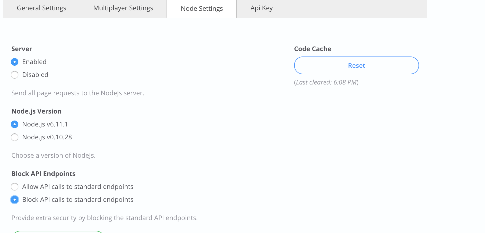

# Epicenter API Proxies

This repository contains Node.js proxies for Epicenter APIs, designed to provide customizable authentication for project API requests.

## Pre-requisites

- Enable NodeJS on your Epicenter project (requires an Enterprise account)
- Set Node version to v6.11.1

## Installation
```
$ npm install --save epicenter-api-proxy
```

## Usage

1. Node.js: Expose your proxy at (any) endpoint
```js
const express = require('express');
const apiProxies = require('epicenter-api-proxy');

const app = express();
app.use('/api-proxy', apiProxies);
```
This will make your proxy available at `https://forio.com/app/<account>/<project>/api-proxy/`
The proxy is an instance of an [Express Router](https://expressjs.com/en/4x/api.html#router), which you can use to add new middleware/ paths.

2. Modify Epicenter.JS to automatically redirect all API requests to this new endpoint

For EpicenterJS versions >= 2.7.0
```js
F.service.URL.defaults.baseURL = 'api-proxy/';
```

For EpicenterJS versions < 2.7.0
```js
var u = new F.service.URL();
F.service.URL.defaults.getAPIPath = function(api) {
    var base = 'api-proxy/' + api + '/';
    if (['run', 'data', 'file', 'presence'].indexOf(api) !== -1) {
        base += u.accountPath + '/' + u.projectPath + '/';
    }
    return base;
}
```
Note: Override before you instantiate any services/managers.

## How it works

The proxy enforces custom access rules for the Run and Data API, and passes through calls to other APIs.

### Data API scoping

By default, scoping for the Data API is enforced by convention for the following patterns:

* `<key>_group_<groupid>` as the collection name for group-level settings.
* `<key>_user_<userid>_group_<groupid>` as the collection name for user-level settings.

#### Usage with DataService

```js
const am = new F.manager.AuthManager();
const { groupId, userId } = am.getCurrentUserSessionInfo();
const groupKey = `some-name_group_${groupId}`;
const groupScopeDataService = new F.service.Data({ root: groupKey });
//Collection will be accessible at api-proxy/data/<account>/<project>/some-name_group_<groupid>

const userKey = `some-name_user_${userId}_group_${session.groupId}`;
const userScopeDataService = new F.service.Data({ root: userKey });
```

While scoping is only enforced for routes matching these patterns, you're free to use any other names at your discretion. See below for information on how to build custom access roles.

### Run API scoping

By default the proxy enforces the following rules:

1. API calls to a specific runid (e.g. `/run/<account>/<project>/<runid>`) are passed theough if you're either:

- The creator of the run (or)
- A facilitator in the group where this run was created


2. For API calls which return multiple runs (e.g. `/run/<account>/<project>/;saved=true`), the following rules apply:

- If you're an end-user, you can only access your own runs.
- If you're a facilitator, you can only access all runs in your group.

## Customizing proxies

### Pick and choose individual proxies

You can select/override individual proxies by requiring them directly.

```js
const express = require('express');
const userMiddleware = require('epicenter-api-proxy/lib/middleware/add-user-middleware');
const runAPIProxy = require('epicenter-api-proxy/lib/run-api-proxy');
const dataAPIProxy = require('epicenter-api-proxy/lib/data-api-proxy');
const app = express();
app.use(userMiddleware); // populates req.user from the session
app.use('/run-api', runAPIProxy);
app.use('/data-api', dataAPIProxy);
```

### Add custom Data API rules
```js

const factory = require('epicenter-api-proxy/lib/data-api-proxy/data-api-router-factory');
const customRouter = factory({
    match: 'settings-collection',
    canRead: (requestParams, userSession)=> {
        const { isFac, id, groupId } = userSession;
        return true; //returning false will return a 401
    },
    canWrite: (requestParams, userSession)=> {
        const { isFac, id, groupId } = userSession;
        return true;
    },
});
app.use(customRouter);// will match /data/<acc>/<project>/settings-collection
```

### Add custom Run API rules
```js
app.use('proxy/run/:account/:project/:runfilter*', (req, res, next)=> {
    const { isFac, id, groupId } = req.user; //added by middleware
    const { runfilter } = req.params;
    //Make sure you add this before the run-api router to override it
});
```


## Appendix: Blocking access to standard endpoints

As an final note, the approach detailed in this README adds additional restrictions on existing Forio APIs forwarded through this proxy.   For a more complete approach, you will want to block API calls to the standard endpoints (e.g. api.forio.com).   

This setting can be found in Epicenter under Project Settings / Node Settings.  Choose "Block API calls to standard endpoints".   This prevents direct access to project APIs.  Specifically, it blocks access with end user/facilitator tokens from external sources.   Access is allowed when calling from within the NodeJs application, or when using a project access token / team member user token.


